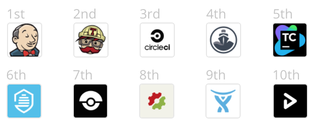
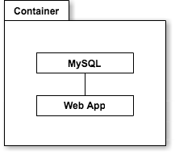
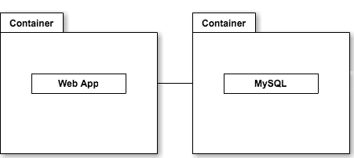

name: inverse
layout: true
class: center, middle, inverse

---

# CI に Wercker を使うべき
# 5つの理由
### ~ Wercker で始める Docker 入門 ~


株式会社プレイド  
山内雅浩  

???

挨拶

---

layout: false

# Agenda

https://algas.github.io/plaid-meetup-20160222

1. サービス紹介
2. 弊社のDocker導入状況
3. CIアンチパターン
4. Werckerを使うべき5つの理由
5. Werckerのイケてないところ
6. 発表のまとめ

???

今日の発表内容

---

class: center, middle, inverse

# サービス紹介

---


???

弊社で開発・運営しているウェブ接客サービスKARTE。  
年間数千億円の流通金額を扱うサービス。  
KARTEを通じて分析している累計ユーザ数は5億人。

---

class: center, middle, inverse

# 弊社のDocker導入状況

---

## 環境ごとのDocker導入状況

.table[

環境 | OS | Docker導入
---- | -- | ---------
開発環境 | macOS | ◯
検証環境 | Ubuntu | ×
CircleCI | Ubuntu | ×
Wercker  | Docker | △
本番環境 | Ubuntu | ×

]

???

Docker導入はこれから

---

class: center, middle, inverse

# CIアンチパターン

CI アンチパターンを3つ紹介します。

---

## CIアンチパターン1

### 「CIが何をしているのか把握できない」

.small-text[
1. OSの基本設定
2. 実行ユーザの作成/アクセス権限の設定
3. 基本OSパッケージのインストール
4. データベースのインストール
5. 言語のインストール
6. リポジトリの展開
7. フレームワーク/ライブラリのインストール
8. アプリの設定とビルド
9. テスト実行環境の設定
10. テストデータの導入
11. ユニットテストの実施
12. e2eテストの実施
13. アプリの配布
14. チャット/メールでの通知
15. 他に何かあった？
]

???

Docker にやらせていることが多すぎる問題  
文字が小さくて読めないのは仕様です

---

## CIアンチパターン2

### 「CIと同じ環境を構築できない」

.logo[


]

???

環境ごとにOSの違い、バージョンの違いがあったりします。

---

## CIアンチパターン3

### 「CIで起こった問題が再現できない」

1. 同じ環境を構築できない
2. CI独自のビルド・デプロイスクリプト
3. CI上でテストするしかないので特定に時間がかかる

???

1. CI用に独自のビルド・デプロイスクリプトを使ってる  
2. 問題の原因が特定できない(環境の問題か、実装の問題か)  
3. 解決してもCIを動かさないと動作を確認できない  


---

class: center, middle, inverse

## Werckerを使うべき5つの理由

5つもなかった。ごめんなさい！  
3つです！

---

## Wercker の基本

- 基本無料
- stackshare の Continuous Integration ランキングで6位



???

使ってるCIに挙手してもらう
1 Jenkins  
2 Travis CI  
3 CircleCI  
4 Codeship  
5 TeamCity  
6 Wercker  
7 Drone.io  
8 Semaphore  
9 Bamboo  
10 Snap CI

---

## Wercker を使うべき理由 1

### Docker ネイティブプラットホーム

.half[

]

```yaml
box:
  id: "ubuntu:16.04"
```

???

Dockerコンテナ上でタスクが実行されます

---

## Wercker を使うべき理由 2

ローカルでタスクを実行できる


???

ローカルでDockerコンテナを起動してそこでタスクが実行されます

---

## Wercker を使うべき理由 3

マイクロサービス対応前 (single container)

```yaml
build:
  steps:
    - install-packages:
        packages: mysql-server libmysqlclient-dev
    - pip-install
    - script:
        name: python build
        code: |
            python build.py
```
.logo[

]

???

1つのコンテナに複数のサービスが同居している

---

## Wercker を使うべき理由 3

マイクロサービス対応後 (multiple containers)

```yaml
build:
  services:
    - id: mysql:5.7
      env:
        MYSQL_RANDOM_ROOT_PASSWORD: yes
  steps:
    - pip-install
    - script:
        name: python build
        code: |
            python build.py
```

.half[

]

???

コンテナごとにサービスを分割してリンクさせます

---


## Wercker の特徴

- タスクのワークフローの作成/変更が簡単  
Workflow > Pipeline > Step

- 他サービスとの連携


---

## Wercker のイケてないところ

- スペルが難しい  

- タスクのトリガーが不自由  

- Dockerfileのビルドに向いてない  

- 古いブログは役に立たない

- キューの状況がGUIで見れない

---

class: center, middle, inverse

# 発表のまとめ

---

## まとめ

Wercker を導入すると以下のことができるようになります。

- CI と同じ環境をローカルに構築できる
- CI と同じタスクをローカルで実行できる
- Dockerfile を書かずに Docker を導入できる


今日使った wercker のファイルは以下においてあります。
https://github.com/algas/wercker-turotial

---

## エンジニア募集中！

株式会社プレイド Engineer/Hunter  
山内雅浩 [@algas](https://github.com/algas)  

- 東京大学大学院理学系研究科 博士課程中退。主に人工衛星の開発を担当。
- 2007年未踏本体採択開発者。
- ゲーム開発ベンチャー、アプリ開発会社CTOを経て、2016年からプレイドに。

### プレイドは一緒に未来を創るエンジニアを募集しています！
https://plaid.co.jp/recruit/engineer.html
